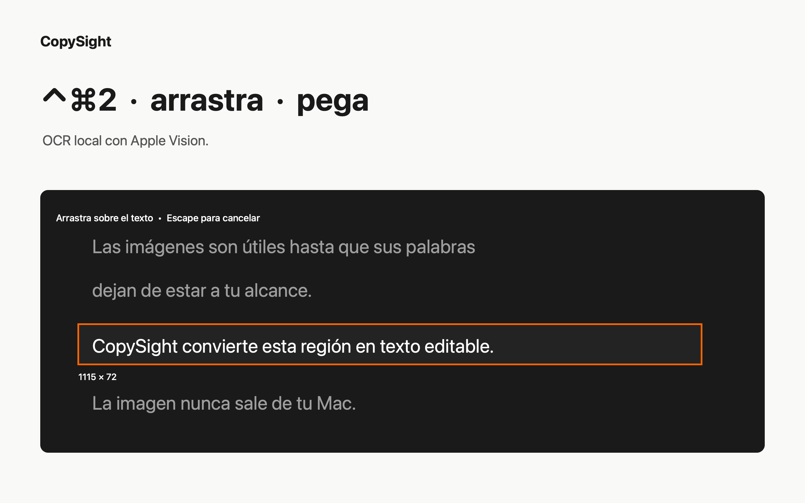
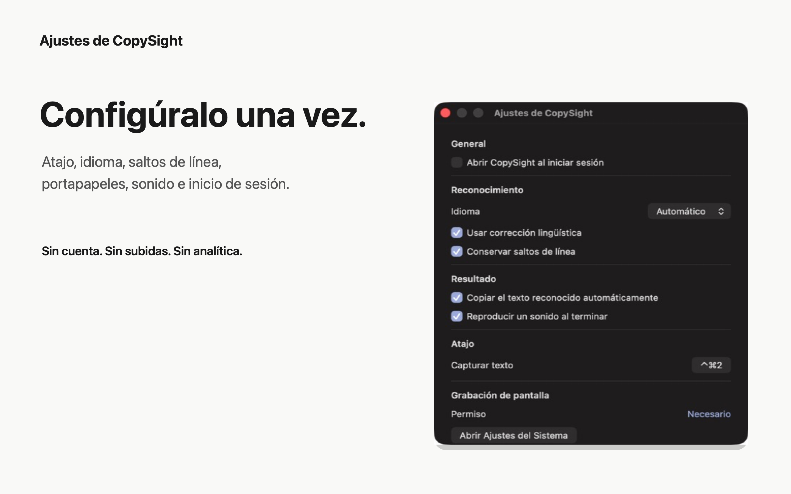

# CopySight

[English](README.md) · Español

**Copia texto de cualquier pantalla de macOS con un atajo.**

CopySight vive en la barra de menús. Pulsa `⌃⌘2`, selecciona una región y pega el texto reconocido donde lo necesites. La captura y el OCR se ejecutan localmente con tecnologías de Apple; no hay cuentas, analítica ni servicios en segundo plano.

[Mac App Store](https://apps.apple.com/es/app/copysight/id6797554906) ·
[Release firmada en GitHub](https://github.com/copysightapp/copysight/releases/download/v1.1.1/CopySight-1.1.1.dmg) ·
[Sitio web](https://copysight.guillermozubikarai.dev/es)



## Qué hace CopySight

- Captura únicamente la región que dibujas, a la resolución nativa de la pantalla.
- Reconoce el texto en el dispositivo con Apple Vision, en modo automático, inglés o español.
- Conserva los saltos de línea y aplica corrección de idioma cuando está activada.
- Copia el resultado automáticamente y permite repetir la región anterior o volver a copiar el último resultado.
- Usa un atajo global configurable sin vigilar el teclado ni pedir permiso de Accesibilidad.
- Funciona como una app nativa de barra de menús, sin icono en el Dock, procesos auxiliares, servidores ni dependencias externas.

## Instalación

### Mac App Store

La [versión de Mac App Store](https://apps.apple.com/es/app/copysight/id6797554906) es la instalación recomendada. Está firmada por Apple y se ejecuta dentro del App Sandbox.

### Descarga directa

El [DMG universal de CopySight 1.1.1](https://github.com/copysightapp/copysight/releases/download/v1.1.1/CopySight-1.1.1.dmg) está firmado con Developer ID, notarizado por Apple y contiene código para Macs Apple Silicon e Intel. Abre el DMG y mueve CopySight a **Aplicaciones**.

### Requisitos

- macOS 14 o posterior.
- Permiso de Grabación de pantalla, solicitado por macOS en la primera captura.

CopySight no necesita permiso de Accesibilidad, conexión a internet ni una cuenta.

## Primera captura

1. Abre CopySight. Su icono de visor aparecerá en la barra de menús.
2. Pulsa `⌃⌘2` o elige **Capturar texto**.
3. Permite Grabación de pantalla cuando macOS lo solicite. Vuelve a abrir la app si el sistema lo pide.
4. Arrastra sobre el texto visible y pégalo con `⌘V`.

Pulsa `Escape` o haz clic derecho durante la selección para cancelar.

## Privacidad

| Datos | Qué ocurre |
| --- | --- |
| Píxeles de pantalla | CopySight captura solo la región seleccionada. Excluye su propia interfaz y no captura audio ni el puntero. |
| Imagen capturada | Permanece en memoria mientras Apple Vision la reconoce. Nunca se escribe en disco ni se sube. |
| Texto reconocido | El último resultado permanece temporalmente en memoria. Si la copia automática está activa, se escribe en el portapapeles de macOS, que otras apps locales pueden leer. |
| Red y telemetría | La app no contiene cliente de red, backend, cuentas, publicidad, analítica ni SDK de terceros. |

La política completa está disponible en [español](https://copysight.guillermozubikarai.dev/es#privacidad) y en [inglés](https://copysight.guillermozubikarai.dev/en#privacy).

## Ajustes



Puedes configurar el inicio de sesión, el idioma de reconocimiento, la corrección y los saltos de línea, la copia automática, el sonido, el atajo global y el permiso de Grabación de pantalla.

## Cómo funciona

`ScreenCaptureKit → Apple Vision → texto en memoria → portapapeles opcional de macOS`

La captura es una imagen puntual, no una transmisión persistente. El OCR se ejecuta fuera del hilo principal y el estado de la app y los menús permanecen en el actor principal.

## Compilar desde el código fuente

CopySight es un paquete Swift para macOS 14 que usa Swift 5.10.

```sh
swift test
./script/build_and_run.sh --verify
```

La app de desarrollo verificada se escribe en `dist/CopySight.app`. Consulta [CONTRIBUTING.md](CONTRIBUTING.md) antes de preparar un cambio.

## Seguridad y licencia

No publiques vulnerabilidades explotables en una incidencia pública. Usa **Security → Report a vulnerability** en GitHub. CopySight se distribuye con la [licencia MIT](LICENSE).
