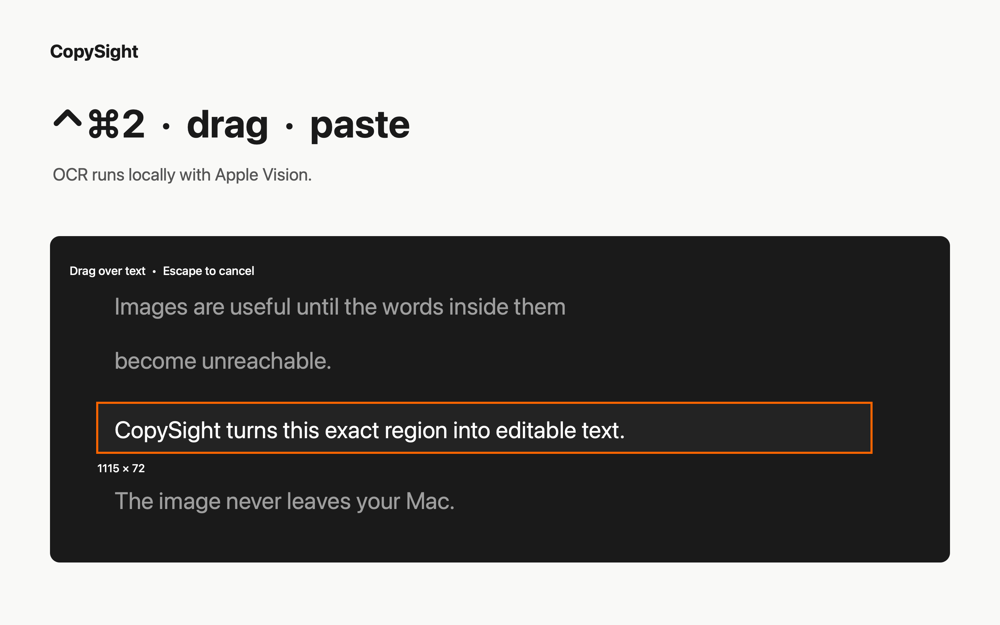
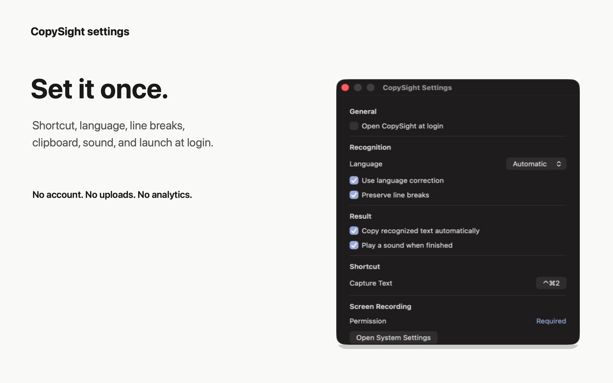

# CopySight

**Copy screen text on macOS with one shortcut.**

CopySight lives in the menu bar. Press `⌃⌘2`, drag over a region, and paste the
recognized text wherever you need it. Capture and OCR run locally with Apple
frameworks; there is no account, analytics, or background service.

[Mac App Store](https://apps.apple.com/app/id6797554906) ·
[Signed direct download](https://copysight.guillermozubikarai.dev/downloads/CopySight-1.1.0.dmg) ·
[Website](https://copysight.guillermozubikarai.dev)



## What CopySight does

- Captures only the screen region you draw, at the display's native resolution.
- Recognizes text on-device with Apple Vision in automatic, English, or Spanish mode.
- Preserves line breaks and applies language correction when enabled.
- Copies the result automatically, with menu actions to repeat the previous region or copy the last result again.
- Uses a configurable global shortcut without monitoring the keyboard or requesting Accessibility permission.
- Runs as a native menu-bar app with no Dock icon, helper process, server, or external dependency.

## Install

### Mac App Store

The [Mac App Store build](https://apps.apple.com/app/id6797554906) is the recommended installation. It is signed by Apple and runs inside the App Sandbox.

### Direct download

The [universal macOS 1.1.0 DMG](https://copysight.guillermozubikarai.dev/downloads/CopySight-1.1.0.dmg) is Developer ID signed, notarized by Apple, and contains both Apple Silicon and Intel code. Open the DMG and move CopySight to **Applications**.

The direct build is notarized but is not currently App Sandbox constrained. See [Security](#security) for the supported disclosure channel.

### Requirements

- macOS 14 or later.
- Screen Recording permission, requested by macOS on the first capture.

CopySight does not require Accessibility permission, an internet connection, or an account.

## First capture

1. Open CopySight. Its viewfinder icon appears in the menu bar.
2. Press `⌃⌘2` or choose **Capture Text**.
3. Allow Screen Recording when macOS asks. Reopen the app if the system requests it.
4. Drag over visible text, then paste with `⌘V`.

Press `Escape` or right-click while selecting to cancel.

## Privacy model

| Data | What happens |
| --- | --- |
| Screen pixels | CopySight captures the selected region only. Its own interface is excluded, and no audio or pointer is captured. |
| Captured image | The image remains in memory while Apple Vision recognizes it. It is never written to disk or uploaded. |
| Recognized text | The latest result remains temporarily in app memory. When automatic copy is enabled, it is written to the macOS clipboard, which other local apps may read. |
| Network and telemetry | The app contains no network client, backend, account system, advertising, analytics, or third-party SDK. |

The complete policy is available in [English](https://copysight.guillermozubikarai.dev/en#privacy) and [Spanish](https://copysight.guillermozubikarai.dev/es#privacidad).

## Settings



CopySight lets you configure:

- launch at login;
- automatic, English, or Spanish recognition;
- language correction and line-break preservation;
- automatic clipboard copy and completion sound;
- the global capture shortcut;
- Screen Recording permission from System Settings.

## How it works

`ScreenCaptureKit → Apple Vision → in-memory text → optional macOS clipboard`

The capture is a one-shot image rather than a persistent stream. OCR runs away from the main thread, while app state and menu updates stay on the main actor.

## Build from source

CopySight is a Swift Package targeting macOS 14 with a Swift 5.10 toolchain.

```sh
swift test
./script/build_and_run.sh --verify
```

The verified development bundle is written to `dist/CopySight.app`.

To create an ad-hoc signed archive for local testing:

```sh
./script/build_and_run.sh --package
```

That ZIP is a development artifact, not the public release. Maintainer release paths live in `script/package_release.sh` and `script/package_app_store.sh`.

## Repository map

| Path | Purpose |
| --- | --- |
| `Sources/CopySight` | AppKit menu-bar application, capture flow, settings, and shortcuts |
| `Sources/CopySightCore` | Vision-based OCR and text layout |
| `Tests/CopySightTests` | Shortcut, geometry, and OCR layout tests |
| `appstore` | App Store entitlements and review screenshots |
| `script` | Development, packaging, icon, and screenshot tooling |
| `web` | Bilingual product site and signed direct download |

## Contributing

Open an issue for a reproducible bug or a focused OCR improvement. Please keep proposals within CopySight's scope: native screen-region text recognition for macOS. Read [CONTRIBUTING.md](CONTRIBUTING.md) before preparing a change.

Before submitting a change:

```sh
swift test
node web/test.mjs
```

## Security

Do not publish exploitable details in a public issue. Use GitHub's **Security → Report a vulnerability** flow so a fix can be prepared privately. Supported versions are documented in [SECURITY.md](SECURITY.md).

## License

CopySight is released under the [MIT License](LICENSE).
